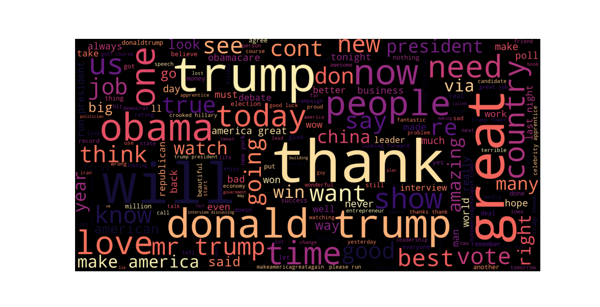
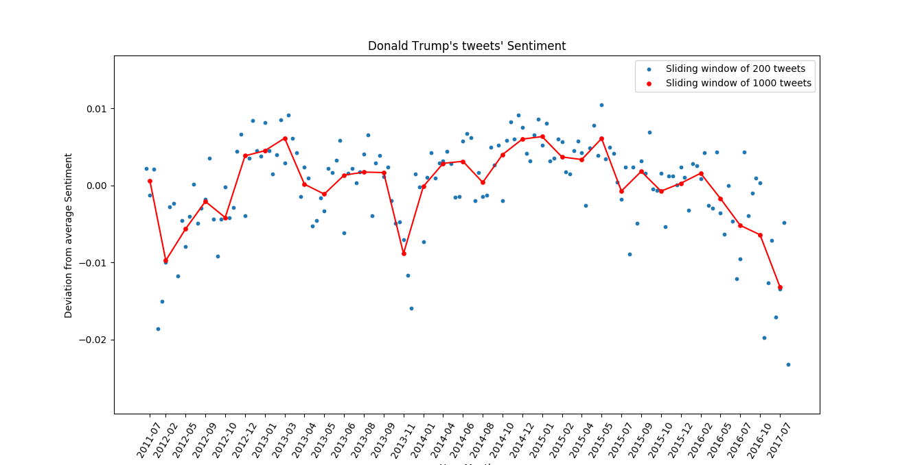

# tweet-sentiment
A textual and sentiment analysis of Donald Trump's tweets from 2009 to 2017

## Environment and Dependancies
* Python 2.7
* NumPy 1.15
* pandas
* pickle
* Doc2Vec
* NLTK
* scikit-learn
* keras
* wordcloud
* matplotlib

## Code
* util.py - Sample a portion of the dataset
* prep_train.py & train.py - Preprocessing of tweets
* cloud.py - Build a Wordcloud from textual data
* embedding_model.py - Train a doc2vec model to learn embeddings from cleaned tweets
* feature_extraction.py & feature_extraction.py - Build feature vectors for training and testing data
* neural_network.py - Train a deep neural network to learn mapping of features to sentiments
* plotting.py - Predict sentiments for Trump's tweets and plot the results

## Datasets and Files
* training.csv - Stanford's sen140 dataset with 1.6 million tweets(Not included, can be found [here](http://help.sentiment140.com/for-students))
* djt_tweets.csv - Trump's tweets from 2009-2017
* truncated.csv - Sample of 200,000 tweets from training.csv
* cleaned_train.csv- Cleaned tweets from truncated.csv
* cleaned_djt.csv - Cleaned tweets from djt_tweets.csv
* d2v.model - trained embedding model
* mat.pk - Features for training(Not included due to large size)
* testmat.pk - Features for testing(Not included due to large size)
* best_model.h5 - Trained weights of the neural network

## Results

### A Wordcloud with the relative size depicting the frequency of occurence of word in tweets
 
 
 
### Variation in the sentiment of Trump's tweets over the years 2009-2017

